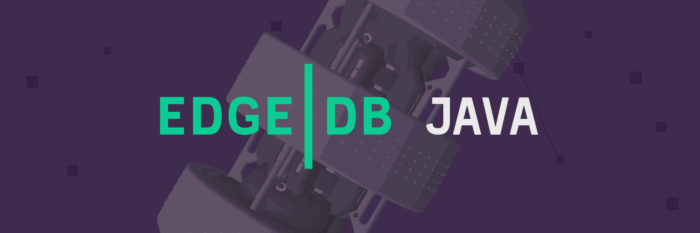

<div align="center">
  <h1>☕ The official Java/JVM client library for Gel ☕</h1>

  <a href="https://github.com/geldata/gel-java/actions" rel="nofollow">
    
  </a>
  <a href="https://github.com/geldata/gel/blob/master/LICENSE">
    
  </a>
  <a href="https://discord.gg/edgedb">
    
  </a>
</div>

## Installation

The Java binding is distrubuted via maven central:

#### Gradle
```groovy
implementation 'com.gel:driver:0.3.0'
```

#### Maven
```xml
<dependency>
  <groupId>com.gel</groupId>
  <artifactId>driver</artifactId>
  <version>0.3.0</version>
</dependency>
```

#### SBT

```scala
libraryDependencies ++= Seq(
  "com.gel" % "driver" % "0.3.0"
)
```

## Usage

The `GelClientPool` class contains all the methods necessary to interact with the Gel database.

```java
import com.gel.driver.GelClientPool;

void main() {
    var clientPool = new GelClientPool();

    clientPool.query(String.class, "SELECT 'Hello, Java!'")
        .thenAccept(System.out::println);
}
```

The `GelClientPool` uses `CompletionStage` for asynchronous operations, allowing you
to integrate it with your favorite asynchronous frameworks

```java
import com.gel.driver.GelClientPool;
import reactor.core.publisher.Mono;

void main() {
    var clientPool = new GelClientPool();

    Mono.fromFuture(clientPool.querySingle(String.class, "SELECT 'Hello, Java!'"))
        .doOnNext(System.out::println)
        .block();
}
```

This also means it plays nicely with other JVM language that support asynchronous programming via `CompletionStage`

```kotlin

import com.gel.driver.GelClientPool
import kotlinx.coroutines.future.await
import kotlinx.coroutines.runBlocking

fun main() {
    val clientPool = GelClientPool()

    runBlocking {
        clientPool.querySingle(String::class.java, "SELECT 'Hello, Kotlin!'")
            .thenAccept { println(it) }
            .await()
    }
}
```

```scala

import com.gel.driver.GelClientPool
import scala.jdk.FutureConverters.*

object Main extends App {
  val clientPool = new GelClientPool()

  clientPool.querySingle(classOf[String], "SELECT 'Hello, Scala!'")
    .asScala
    .map(println)
}
```

## Examples
Some examples of using the Java clientPool api can be found in the [examples](./examples) directory.

## Compiling
This project uses gradle. To build the project run the following command:

```bash
./gradlew build
```
